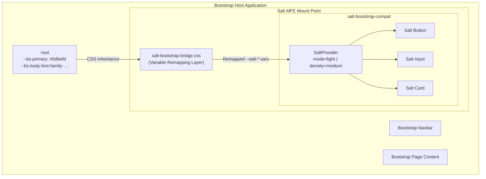
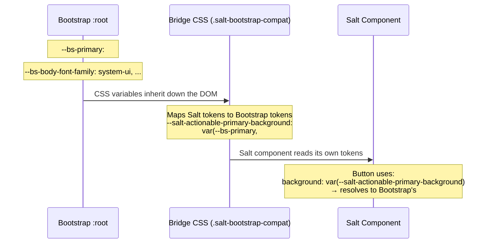
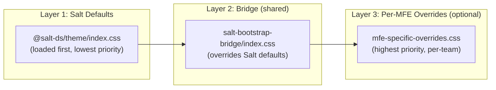
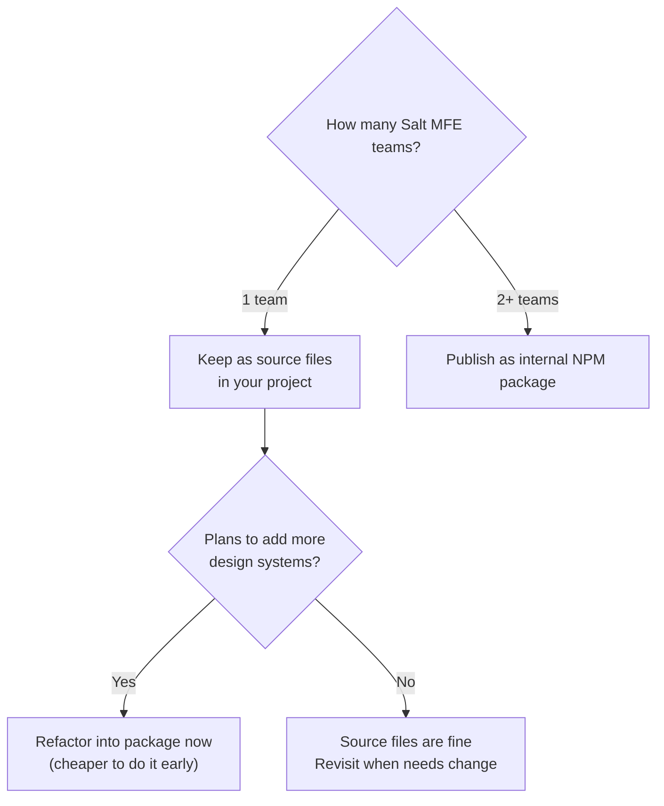
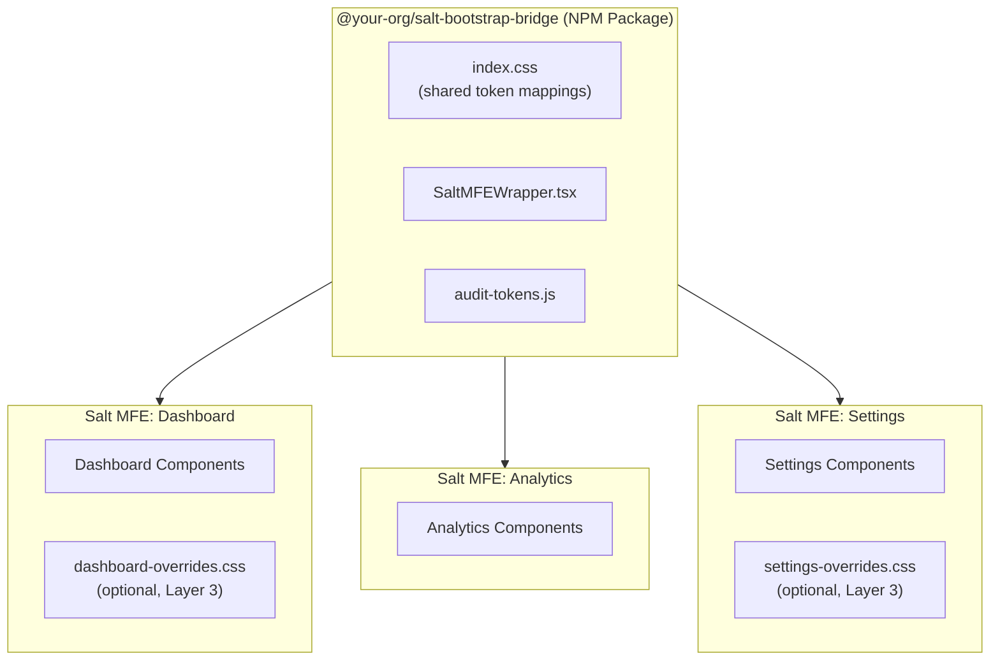
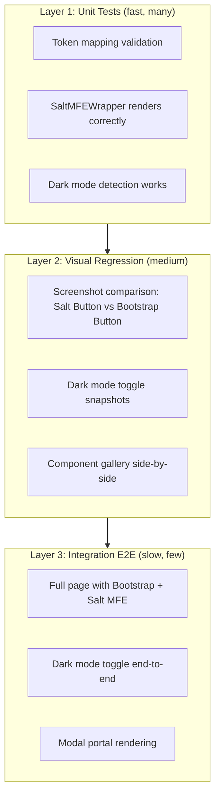
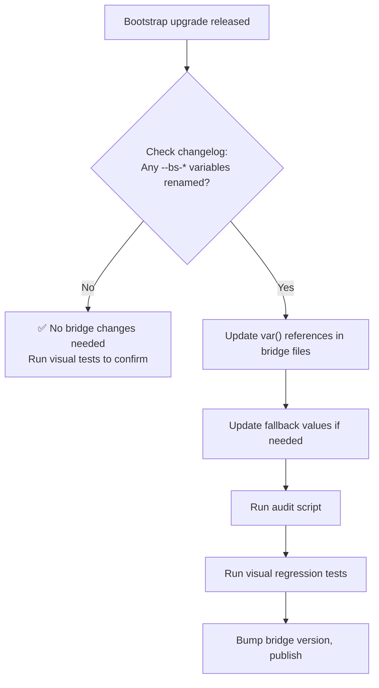
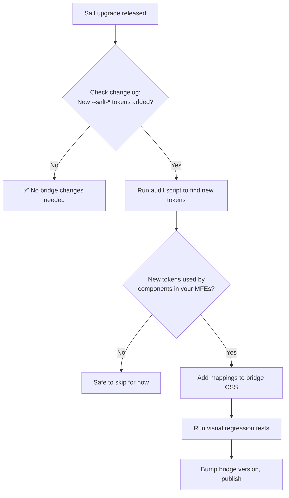

# Low-Level Design (LLD): CSS Variable Remapping — Salt ↔ Bootstrap Bridge

**Document Version:** 2.0  
**Date:** 2026-09-27  
**Status:** Approved  
**Audience:** Frontend Developers, Tech Leads, Architects

---

## Table of Contents

1. [Overview & Objective](#1-overview--objective)
2. [Architecture](#2-architecture)
3. [Quick-Start Guide (5 Minutes)](#3-quick-start-guide-5-minutes)
4. [File Structure & Package Strategy](#4-file-structure--package-strategy)
5. [Detailed Token Mapping](#5-detailed-token-mapping)
6. [React Wrapper Component](#6-react-wrapper-component)
7. [Edge Cases & Special Handling](#7-edge-cases--special-handling)
8. [Component-Specific Overrides](#8-component-specific-override-recipes)
9. [Developer Experience (DX) Tooling](#9-developer-experience-dx-tooling)
10. [Scalability Patterns](#10-scalability-patterns)
11. [Testing Strategy](#11-testing-strategy)
12. [CI/CD Integration](#12-cicd-integration)
13. [Implementation Phases](#13-implementation-phases)
14. [Maintenance Playbook](#14-maintenance-playbook)
15. [Versioning & Compatibility](#15-versioning--compatibility)
16. [Troubleshooting & FAQ](#16-troubleshooting--faq)
17. [Developer Onboarding Checklist](#17-developer-onboarding-checklist)
18. [Contribution Guidelines](#18-contribution-guidelines)
19. [Risks & Mitigations](#19-risks--mitigations)
20. [Decision Log](#20-decision-log)

---

## 1. Overview & Objective

### 1.1 Problem Statement
A micro-frontend (MFE) built with the **Salt Design System** (`@salt-ds/core`, `@salt-ds/theme`) must be visually consistent with the **Bootstrap 5** host application. Users should not perceive any visual difference between the two systems.

### 1.2 Solution
Override Salt's CSS custom properties (design tokens) at the **wrapper boundary** with values derived from Bootstrap's CSS custom properties. This leverages both systems' native theming mechanisms without modifying either system's source code.

### 1.3 Scope
| In Scope | Out of Scope |
|---|---|
| Visual alignment (colors, typography, spacing, borders, shadows) | Functional behavior changes of Salt components |
| Light & Dark mode support | Mobile-native theming |
| Density mapping (Salt density ↔ Bootstrap sizing) | Accessibility remediation of either system |
| Portal-based components (modals, tooltips) | Migration of Salt components to Bootstrap |

### 1.4 Key Design Principles

| Principle | What It Means in Practice |
|---|---|
| **Zero Modification** | Never fork or patch Salt or Bootstrap source code |
| **Fallback Safety** | Every `var()` includes a hardcoded fallback — the bridge works even if Bootstrap variables are missing |
| **Scoped Boundary** | Bridge styling only activates inside `.salt-bootstrap-compat` — cannot accidentally affect anything outside |
| **Additive Only** | New tokens are added to the bridge; existing mappings are never removed (only updated) |
| **Single Source of Truth** | Bootstrap's theme is THE source of truth. The bridge only references it — never duplicates values |

---

## 2. Architecture

### 2.1 High-Level Architecture Diagram



### 2.2 CSS Variable Resolution Flow



### 2.3 Layered Override Architecture

The bridge uses a **3-layer CSS cascade** for maximum flexibility:



**Why 3 layers?**
- **Layer 1** = Salt's out-of-the-box theme (you don't touch this)
- **Layer 2** = Shared bridge (maintained centrally, used by all Salt MFEs)
- **Layer 3** = Optional per-MFE overrides for edge cases specific to one team's components

### 2.4 DOM Structure

```html
<body>
  <!-- Bootstrap host app -->
  <nav class="navbar navbar-dark bg-primary">...</nav>
  
  <div class="container">
    <div class="row">
      <div class="col-md-8"><!-- Bootstrap content --></div>
      
      <!-- Salt MFE mount point -->
      <div class="col-md-4">
        <div id="salt-mfe-root">
          <!-- BRIDGE BOUNDARY -->
          <div class="salt-bootstrap-compat">
            <div class="salt-provider salt-theme salt-density-medium" data-mode="light">
              <button class="saltButton">Looks like Bootstrap</button>
              <input class="saltInput" />
            </div>
          </div>
        </div>
      </div>
    </div>
  </div>

  <!-- Portal target for Salt modals/tooltips (see Section 7.2) -->
  <div id="salt-portal-root" class="salt-bootstrap-compat">
    <div class="salt-provider salt-theme" data-mode="light">
      <!-- Salt portals render here with correct styling -->
    </div>
  </div>
</body>
```

---

## 3. Quick-Start Guide (5 Minutes)

> [!TIP]
> **For developers who just want to get started.** Follow these 4 steps and you'll have a working Salt MFE that looks like Bootstrap.

### Step 1: Install the bridge (if published as a package)

```bash
npm install @your-org/salt-bootstrap-bridge
```

Or if using the bridge from source, copy `src/styles/salt-bootstrap-bridge/` into your project.

### Step 2: Import in your MFE entry point

```tsx
// Your MFE's main entry file
import '@salt-ds/theme/index.css';                           // Salt's theme (required)
import '@your-org/salt-bootstrap-bridge/index.css';           // Bridge overrides (required)
// OR if from source:
// import '../styles/salt-bootstrap-bridge/index.css';
```

### Step 3: Wrap your MFE root

```tsx
import { SaltMFEWrapper } from '@your-org/salt-bootstrap-bridge';

function MyMicroFrontend() {
  return (
    <SaltMFEWrapper colorMode="light" density="medium">
      {/* All your Salt components go here */}
      <Button variant="cta">Submit</Button>
      <Input label="Email" />
    </SaltMFEWrapper>
  );
}
```

### Step 4: Verify in DevTools

1. Right-click any Salt component → **Inspect**
2. In the Styles panel, look for `--salt-actionable-primary-background`
3. ✅ It should show `var(--bs-primary, #0d6efd)` — not Salt's default color
4. If it does → **you're done!**

```
 ✅ Checklist:
 [ ] Salt Button is blue (#0d6efd), not Salt's default teal
 [ ] Font matches the rest of the Bootstrap page
 [ ] Border-radius matches Bootstrap's rounded corners
 [ ] Focus ring matches Bootstrap's blue glow
```

---

## 4. File Structure & Package Strategy

### 4.1 Source File Structure

```
salt-bootstrap-bridge/
├── index.css                      ← Main entry (imports all partials)
├── _colors.css                    ← Color token mappings (actionable, container, content)
├── _typography.css                ← Font family, sizes, weights, line-heights
├── _spacing.css                   ← Spacing scale mapping
├── _borders.css                   ← Border radius (curve), width, style
├── _shadows.css                   ← Box shadow mappings
├── _status.css                    ← Status colors (error, warning, success, info)
├── _dark-mode.css                 ← Dark mode overrides + auto-sync
├── _component-overrides.css       ← Component-specific fine-tuning (button, input, card)
├── SaltMFEWrapper.tsx             ← React wrapper component
├── SaltMFEWrapper.test.tsx        ← Component tests
├── index.ts                       ← Public exports
├── scripts/
│   ├── audit-tokens.js            ← Detect unmapped Salt tokens (see Section 9)
│   └── generate-compatibility.js  ← Auto-generate compatibility report
├── README.md                      ← Developer documentation
└── CHANGELOG.md                   ← Track all bridge changes
```

### 4.2 NPM Package Strategy (For Scalability)

> [!IMPORTANT]
> **Publish the bridge as an internal NPM package** when more than 1 team uses it. This is the single most important scalability decision.

```json
// package.json
{
  "name": "@your-org/salt-bootstrap-bridge",
  "version": "1.0.0",
  "description": "CSS Variable bridge to make Salt DS components visually match Bootstrap 5",
  "main": "index.ts",
  "style": "index.css",
  "files": [
    "*.css",
    "*.tsx",
    "*.ts",
    "scripts/"
  ],
  "peerDependencies": {
    "@salt-ds/core": ">=1.30.0",
    "@salt-ds/theme": ">=1.28.0",
    "bootstrap": ">=5.3.0",
    "react": ">=18.0.0"
  },
  "scripts": {
    "audit": "node scripts/audit-tokens.js",
    "test": "jest",
    "visual-test": "playwright test --config=visual.config.ts"
  }
}
```

**Why a package?**

| Without Package | With Package |
|---|---|
| Each MFE team copies bridge files | `npm install` — done |
| One team fixes a bug, others don't get it | `npm update` — everyone gets the fix |
| No versioning — breaking changes surprise teams | Semantic versioning — teams upgrade on their own schedule |
| No changelog | `CHANGELOG.md` automatically maintained |
| Bridge quality depends on each team | Central team owns quality, tests, CI |

### 4.3 When to Publish as Package



---

## 5. Detailed Token Mapping

> [!IMPORTANT]
> Salt organizes tokens into **8 characteristic groups**. Each must be mapped to Bootstrap equivalents. The tables below show the **complete mapping strategy** per characteristic.

### 5.1 Token Naming Convention Reference

**Salt token format:**
```
--salt-[characteristic]-[specifier]-[emphasis]-[variant]-[property]-[state]
```

**Bootstrap variable format:**
```
--bs-[component]-[property]-[state]
```

**Quick lookup: "I need to style X, which token controls it?"**

| I Want To Style... | Salt Token Pattern | Bridge Maps To |
|---|---|---|
| Button background | `--salt-actionable-primary-background` | `--bs-primary` |
| Button hover | `--salt-actionable-primary-background-hover` | `--bs-primary` darkened |
| Text color | `--salt-content-primary-foreground` | `--bs-body-color` |
| Card background | `--salt-container-primary-background` | `--bs-body-bg` |
| Error message | `--salt-status-error-foreground` | `--bs-danger` |
| Font family | `--salt-text-fontFamily` | `--bs-body-font-family` |
| Border radius | `--salt-curve-150` | `--bs-border-radius` |
| Shadow | `--salt-overlayable-shadow-default` | `--bs-box-shadow` |

---

### 5.2 Actionable Tokens (Buttons, Links, Interactive Elements)

These are the most critical — they control how Salt's `<Button>`, `<Link>`, and other interactive components look.

**File:** `_colors.css`

| Salt Token | Bootstrap Mapping | Fallback | Notes |
|---|---|---|---|
| `--salt-actionable-primary-background` | `var(--bs-primary)` | `#0d6efd` | Primary button bg |
| `--salt-actionable-primary-background-hover` | `var(--bs-primary-hover)` | `#0b5ed7` | Primary button hover |
| `--salt-actionable-primary-background-active` | `var(--bs-primary-active)` | `#0a58ca` | Primary button pressed |
| `--salt-actionable-primary-background-disabled` | `var(--bs-secondary-bg)` | `#e9ecef` | Disabled state |
| `--salt-actionable-primary-foreground` | — | `#ffffff` | White text on primary bg |
| `--salt-actionable-primary-foreground-disabled` | `var(--bs-secondary-color)` | `#6c757d` | Disabled text |
| `--salt-actionable-secondary-background` | — | `transparent` | Secondary = outline style |
| `--salt-actionable-secondary-background-hover` | `var(--bs-secondary-bg-subtle)` | `#f8f9fa` | Light hover fill |
| `--salt-actionable-secondary-foreground` | `var(--bs-primary)` | `#0d6efd` | Text color matches primary |
| `--salt-actionable-secondary-borderColor` | `var(--bs-primary)` | `#0d6efd` | Outline border |
| `--salt-actionable-cta-background` | `var(--bs-success)` | `#198754` | CTA = Bootstrap success |
| `--salt-actionable-cta-background-hover` | — | `#157347` | Darker green hover |
| `--salt-actionable-cta-foreground` | — | `#ffffff` | White text on CTA |

```css
/* _colors.css — Actionable characteristic */

.salt-bootstrap-compat {
  /* ── Primary Actions (filled buttons) ── */
  --salt-actionable-primary-background:          var(--bs-primary, #0d6efd);
  --salt-actionable-primary-background-hover:    var(--bs-primary-hover, #0b5ed7);
  --salt-actionable-primary-background-active:   #0a58ca;
  --salt-actionable-primary-background-disabled: var(--bs-secondary-bg, #e9ecef);
  --salt-actionable-primary-foreground:          #ffffff;
  --salt-actionable-primary-foreground-hover:    #ffffff;
  --salt-actionable-primary-foreground-active:   #ffffff;
  --salt-actionable-primary-foreground-disabled: var(--bs-secondary-color, #6c757d);

  /* ── Secondary Actions (outline/ghost buttons) ── */
  --salt-actionable-secondary-background:        transparent;
  --salt-actionable-secondary-background-hover:  rgba(var(--bs-primary-rgb, 13, 110, 253), 0.08);
  --salt-actionable-secondary-foreground:        var(--bs-primary, #0d6efd);
  --salt-actionable-secondary-borderColor:       var(--bs-primary, #0d6efd);

  /* ── CTA Actions ── */
  --salt-actionable-cta-background:              var(--bs-success, #198754);
  --salt-actionable-cta-background-hover:        #157347;
  --salt-actionable-cta-foreground:              #ffffff;
}
```

---

### 5.3 Container Tokens (Cards, Panels, Dialogs)

**File:** `_colors.css`

```css
.salt-bootstrap-compat {
  --salt-container-primary-background:     var(--bs-body-bg, #ffffff);
  --salt-container-primary-borderColor:    var(--bs-border-color, #dee2e6);
  --salt-container-secondary-background:   var(--bs-secondary-bg, #e9ecef);
  --salt-container-secondary-borderColor:  var(--bs-border-color, #dee2e6);
  --salt-container-tertiary-background:    var(--bs-tertiary-bg, #f8f9fa);
}
```

---

### 5.4 Content Tokens (Text, Icons, Foreground)

**File:** `_colors.css`

```css
.salt-bootstrap-compat {
  --salt-content-primary-foreground:    var(--bs-body-color, #212529);
  --salt-content-secondary-foreground:  var(--bs-secondary-color, #6c757d);
  --salt-content-primary-background:    var(--bs-body-bg, #ffffff);
}
```

---

### 5.5 Text / Typography Tokens

**File:** `_typography.css`

```css
.salt-bootstrap-compat {
  /* ── Base text styles ── */
  --salt-text-fontFamily:     var(--bs-body-font-family, system-ui, -apple-system, "Segoe UI", Roboto, "Helvetica Neue", "Noto Sans", sans-serif);
  --salt-text-fontSize:       var(--bs-body-font-size, 1rem);
  --salt-text-fontWeight:     var(--bs-body-font-weight, 400);
  --salt-text-lineHeight:     var(--bs-body-line-height, 1.5);
  --salt-text-letterSpacing:  0;

  /* ── Override Salt's default font families to match Bootstrap ── */
  --salt-typography-fontFamily-openSans:   var(--bs-body-font-family, system-ui, sans-serif);
  --salt-typography-fontFamily-amplitude:  var(--bs-body-font-family, system-ui, sans-serif);
  --salt-typography-fontFamily-ptMono:     var(--bs-font-monospace, SFMono-Regular, Menlo, Monaco, Consolas, monospace);

  /* ── Font weights ── */
  --salt-typography-fontWeight-light:      300;
  --salt-typography-fontWeight-regular:    var(--bs-body-font-weight, 400);
  --salt-typography-fontWeight-medium:     500;
  --salt-typography-fontWeight-semiBold:   600;
  --salt-typography-fontWeight-bold:       700;
}
```

---

### 5.6 Status Tokens (Error, Warning, Success, Info)

**File:** `_status.css`

```css
.salt-bootstrap-compat {
  /* ── Error / Danger ── */
  --salt-status-error-foreground:    var(--bs-danger, #dc3545);
  --salt-status-error-background:    var(--bs-danger-bg-subtle, #f8d7da);
  --salt-status-error-borderColor:   var(--bs-danger-border-subtle, #f5c2c7);

  /* ── Warning ── */
  --salt-status-warning-foreground:  var(--bs-warning, #ffc107);
  --salt-status-warning-background:  var(--bs-warning-bg-subtle, #fff3cd);
  --salt-status-warning-borderColor: var(--bs-warning-border-subtle, #ffecb5);

  /* ── Success / Positive ── */
  --salt-status-success-foreground:  var(--bs-success, #198754);
  --salt-status-success-background:  var(--bs-success-bg-subtle, #d1e7dd);
  --salt-status-success-borderColor: var(--bs-success-border-subtle, #badbcc);

  /* ── Info ── */
  --salt-status-info-foreground:     var(--bs-info, #0dcaf0);
  --salt-status-info-background:     var(--bs-info-bg-subtle, #cff4fc);
  --salt-status-info-borderColor:    var(--bs-info-border-subtle, #b6effb);
}
```

---

### 5.7 Spacing Tokens

**File:** `_spacing.css`

Salt uses density-dependent spacing. The base unit `--salt-spacing-100` varies by density.

| Salt Token | Bootstrap Equivalent | Value (medium) |
|---|---|---|
| `--salt-spacing-25` | `$spacer * 0.125` | `2px` |
| `--salt-spacing-50` | `$spacer * 0.25` | `4px` |
| `--salt-spacing-100` | `$spacer * 0.5` | `8px` |
| `--salt-spacing-200` | `$spacer * 1` | `16px` |
| `--salt-spacing-300` | `$spacer * 1.5` | `24px` |
| `--salt-spacing-400` | `$spacer * 2` | `32px` |

```css
.salt-bootstrap-compat .salt-density-medium,
.salt-bootstrap-compat.salt-density-medium {
  --salt-spacing-100: 8px;
  --salt-spacing-25:  calc(0.25 * var(--salt-spacing-100));
  --salt-spacing-50:  calc(0.5  * var(--salt-spacing-100));
  --salt-spacing-75:  calc(0.75 * var(--salt-spacing-100));
  --salt-spacing-150: calc(1.5  * var(--salt-spacing-100));
  --salt-spacing-200: calc(2    * var(--salt-spacing-100));
  --salt-spacing-250: calc(2.5  * var(--salt-spacing-100));
  --salt-spacing-300: calc(3    * var(--salt-spacing-100));
  --salt-spacing-350: calc(3.5  * var(--salt-spacing-100));
  --salt-spacing-400: calc(4    * var(--salt-spacing-100));
}
```

---

### 5.8 Border / Curve Tokens

**File:** `_borders.css`

```css
.salt-bootstrap-compat {
  --salt-curve-0:   0px;
  --salt-curve-50:  1px;
  --salt-curve-100: var(--bs-border-radius-sm, 0.25rem);
  --salt-curve-150: var(--bs-border-radius, 0.375rem);
  --salt-curve-200: var(--bs-border-radius, 0.375rem);
  --salt-curve-250: var(--bs-border-radius, 0.375rem);
  --salt-curve-300: var(--bs-border-radius-lg, 0.5rem);
  --salt-curve-350: var(--bs-border-radius-lg, 0.5rem);
  --salt-curve-999: var(--bs-border-radius-pill, 50rem);
}
```

---

### 5.9 Shadow Tokens

**File:** `_shadows.css`

```css
.salt-bootstrap-compat {
  --salt-overlayable-shadow-scroll:       var(--bs-box-shadow-sm, 0 .125rem .25rem rgba(0,0,0,.075));
  --salt-overlayable-shadow-default:      var(--bs-box-shadow, 0 .5rem 1rem rgba(0,0,0,.15));
  --salt-overlayable-shadow-region:       var(--bs-box-shadow, 0 .5rem 1rem rgba(0,0,0,.15));
  --salt-overlayable-shadow-overlay:      var(--bs-box-shadow-lg, 0 1rem 3rem rgba(0,0,0,.175));
}
```

---

## 6. React Wrapper Component

### 6.1 `SaltMFEWrapper.tsx`

```tsx
import React, { useEffect, useMemo, useState } from 'react';
import { SaltProvider } from '@salt-ds/core';
import '@salt-ds/theme/index.css';
import './index.css'; // bridge CSS

interface SaltMFEWrapperProps {
  children: React.ReactNode;
  /** Sync with Bootstrap's current color mode. 'auto' detects from [data-bs-theme] */
  colorMode?: 'light' | 'dark' | 'auto';
  /** Salt density — 'medium' maps closest to Bootstrap's default sizing */
  density?: 'high' | 'medium' | 'low' | 'touch';
  /** Optional: custom class name for additional scoping */
  className?: string;
  /** Optional: enable debug mode to log token resolution warnings */
  debug?: boolean;
}

/**
 * Wraps any Salt Design System micro-frontend to visually
 * match the Bootstrap host application's look and feel.
 *
 * HOW IT WORKS:
 * 1. The .salt-bootstrap-compat class activates CSS variable remapping
 * 2. Salt tokens (--salt-*) are redefined to reference Bootstrap tokens (--bs-*)
 * 3. Salt components read their own tokens → get Bootstrap values → look like Bootstrap
 *
 * @example
 * <SaltMFEWrapper colorMode="auto" density="medium">
 *   <Button variant="cta">Submit</Button>
 * </SaltMFEWrapper>
 */
export const SaltMFEWrapper: React.FC<SaltMFEWrapperProps> = ({
  children,
  colorMode = 'auto',
  density = 'medium',
  className = '',
  debug = false,
}) => {
  const [bsTheme, setBsTheme] = useState<'light' | 'dark'>(() => {
    const attr = document.documentElement.getAttribute('data-bs-theme');
    return attr === 'dark' ? 'dark' : 'light';
  });

  // Auto-detect Bootstrap theme changes
  useEffect(() => {
    if (colorMode !== 'auto') return;

    const observer = new MutationObserver(() => {
      const attr = document.documentElement.getAttribute('data-bs-theme');
      setBsTheme(attr === 'dark' ? 'dark' : 'light');
    });

    observer.observe(document.documentElement, {
      attributes: true,
      attributeFilter: ['data-bs-theme'],
    });

    return () => observer.disconnect();
  }, [colorMode]);

  // Debug mode: log warnings for unmapped tokens
  useEffect(() => {
    if (!debug) return;
    const el = document.querySelector('.salt-bootstrap-compat');
    if (!el) return;

    const styles = getComputedStyle(el);
    const unmapped: string[] = [];

    // Check a sample of critical tokens
    const criticalTokens = [
      '--salt-actionable-primary-background',
      '--salt-content-primary-foreground',
      '--salt-container-primary-background',
      '--salt-text-fontFamily',
    ];

    criticalTokens.forEach(token => {
      const val = styles.getPropertyValue(token).trim();
      if (!val) unmapped.push(token);
    });

    if (unmapped.length > 0) {
      console.warn(
        '[SaltMFEWrapper] Unmapped tokens detected:',
        unmapped,
        '\nThese tokens will fall back to Salt defaults.'
      );
    }
  }, [debug]);

  const resolvedMode = colorMode === 'auto' ? bsTheme : colorMode;

  return (
    <div className={`salt-bootstrap-compat ${className}`.trim()}>
      <SaltProvider mode={resolvedMode} density={density}>
        {children}
      </SaltProvider>
    </div>
  );
};

export default SaltMFEWrapper;
```

### 6.2 Usage in the Bootstrap Host App

```tsx
import SaltMFEWrapper from '@your-org/salt-bootstrap-bridge';
import SaltDashboardMFE from './micro-frontends/salt-mfe/App';

function DashboardPage() {
  return (
    <div className="container-fluid">
      <nav className="navbar navbar-dark bg-primary">
        <span className="navbar-brand">My App</span>
      </nav>

      <div className="row mt-4">
        <div className="col-md-3">
          <div className="list-group">
            <a className="list-group-item active">Dashboard</a>
            <a className="list-group-item">Settings</a>
          </div>
        </div>

        {/* Salt MFE — visually matches Bootstrap */}
        <div className="col-md-9">
          <SaltMFEWrapper colorMode="auto" density="medium">
            <SaltDashboardMFE />
          </SaltMFEWrapper>
        </div>
      </div>
    </div>
  );
}
```

---

## 7. Edge Cases & Special Handling

### 7.1 Dark Mode Sync

**File:** `_dark-mode.css`

Bootstrap 5.3+ uses `[data-bs-theme="dark"]` on the `<html>` element. The bridge handles this automatically:

```css
[data-bs-theme="dark"] .salt-bootstrap-compat,
.salt-bootstrap-compat[data-mode="dark"] {
  --salt-container-primary-background:     var(--bs-body-bg, #212529);
  --salt-container-primary-borderColor:    var(--bs-border-color, #495057);
  --salt-container-secondary-background:   var(--bs-secondary-bg, #343a40);

  --salt-content-primary-foreground:       var(--bs-body-color, #dee2e6);
  --salt-content-secondary-foreground:     var(--bs-secondary-color, #adb5bd);

  --salt-actionable-primary-background:    var(--bs-primary, #0d6efd);
  --salt-actionable-secondary-foreground:  var(--bs-primary, #6ea8fe);
}
```

### 7.2 Portal-Based Components (Modals, Tooltips, Dialogs)

> [!WARNING]
> Salt's `Dialog`, `Tooltip`, and `Overlay` components render via React portals to `document.body` — **outside** the `.salt-bootstrap-compat` wrapper. They lose all bridge styling.

**Solution:** Dedicated portal root with bridge class:

```tsx
// In your app's root layout (rendered once)
function AppLayout({ children }) {
  return (
    <>
      {children}
      <div id="salt-portal-root" className="salt-bootstrap-compat">
        <SaltProvider mode="light" density="medium">
          {/* Salt portals render here */}
        </SaltProvider>
      </div>
    </>
  );
}
```

Configure Salt components to use this target:

```tsx
<Dialog
  open={isOpen}
  onOpenChange={setIsOpen}
  container={document.getElementById('salt-portal-root')}
>
  <Dialog.Header>Confirm Action</Dialog.Header>
  <Dialog.Content>Are you sure?</Dialog.Content>
</Dialog>
```

### 7.3 Z-Index Alignment

```css
.salt-bootstrap-compat {
  --salt-zIndex-default:       auto;
  --salt-zIndex-appHeader:     var(--bs-zindex-sticky, 1020);
  --salt-zIndex-popout:        var(--bs-zindex-dropdown, 1000);
  --salt-zIndex-floating:      var(--bs-zindex-popover, 1070);
  --salt-zIndex-overlay:       var(--bs-zindex-modal, 1055);
  --salt-zIndex-notification:  var(--bs-zindex-toast, 1090);
}
```

### 7.4 Focus Ring Styling

```css
.salt-bootstrap-compat {
  --salt-focused-outlineColor:  var(--bs-focus-ring-color, rgba(13, 110, 253, 0.25));
  --salt-focused-outlineWidth:  var(--bs-focus-ring-width, 0.25rem);
  --salt-focused-outlineStyle:  solid;
  --salt-focused-outlineOffset: 0;
}
```

---

## 8. Component-Specific Override Recipes

**File:** `_component-overrides.css`

### 8.1 Salt Button → Bootstrap Button

```css
.salt-bootstrap-compat .saltButton {
  padding: 0.375rem 0.75rem;
  font-size: 1rem;
  transition: color .15s ease-in-out, 
              background-color .15s ease-in-out, 
              border-color .15s ease-in-out, 
              box-shadow .15s ease-in-out;
}
```

### 8.2 Salt Input → Bootstrap Form Control

```css
.salt-bootstrap-compat .saltInput {
  min-height: calc(1.5em + 0.75rem + calc(var(--bs-border-width, 1px) * 2));
  padding: 0.375rem 0.75rem;
  border-radius: var(--bs-border-radius, 0.375rem);
}
```

### 8.3 Salt Card → Bootstrap Card

```css
.salt-bootstrap-compat .saltCard {
  border: var(--bs-border-width, 1px) solid var(--bs-border-color, #dee2e6);
  border-radius: var(--bs-border-radius, 0.375rem);
  box-shadow: none;
}
```

---

## 9. Developer Experience (DX) Tooling

> [!TIP]
> Great DX is what makes the bridge **maintainable long-term**. These tools catch problems before they reach production.

### 9.1 Automated Token Audit Script

This script scans your Salt MFE's rendered output and detects any `--salt-*` tokens that the bridge **hasn't mapped**. Run it as part of your CI pipeline or locally.

**File:** `scripts/audit-tokens.js`

```js
#!/usr/bin/env node

/**
 * Salt-Bootstrap Bridge — Token Audit Tool
 * 
 * PURPOSE: Detect Salt CSS variables that are NOT remapped in the bridge.
 * These tokens will render with Salt's default values, breaking visual consistency.
 *
 * USAGE:
 *   node scripts/audit-tokens.js <path-to-bridge-css>
 *
 * EXAMPLE:
 *   node scripts/audit-tokens.js src/styles/salt-bootstrap-bridge/index.css
 *
 * EXIT CODES:
 *   0 = All tokens mapped (or only known-safe unmapped tokens)
 *   1 = Unmapped tokens found that need attention
 */

const fs = require('fs');
const path = require('path');

// Tokens that are safe to leave unmapped (internal/private Salt tokens)
const SAFE_UNMAPPED = new Set([
  '--salt-palette-',     // Low-level palette (not used directly by components)
  '--salt-foundation-',  // Foundation layer (internal)
]);

function auditBridgeCSS(bridgePath) {
  const bridgeCSS = fs.readFileSync(bridgePath, 'utf-8');

  // Extract all --salt-* tokens the bridge defines
  const mappedTokens = new Set();
  const tokenRegex = /--salt-[\w-]+/g;
  let match;
  while ((match = tokenRegex.exec(bridgeCSS)) !== null) {
    mappedTokens.add(match[0]);
  }

  console.log(`✅ Bridge defines ${mappedTokens.size} token mappings`);

  // Scan installed Salt theme CSS for all tokens that exist
  const saltThemePath = path.resolve('node_modules/@salt-ds/theme/index.css');
  if (!fs.existsSync(saltThemePath)) {
    console.warn('⚠️  @salt-ds/theme not found in node_modules. Install it first.');
    return;
  }

  const saltCSS = fs.readFileSync(saltThemePath, 'utf-8');
  const allSaltTokens = new Set();
  while ((match = tokenRegex.exec(saltCSS)) !== null) {
    allSaltTokens.add(match[0]);
  }

  // Find unmapped tokens
  const unmapped = [...allSaltTokens].filter(token => {
    if (mappedTokens.has(token)) return false;
    // Check if it's in the safe-to-skip list
    for (const prefix of SAFE_UNMAPPED) {
      if (token.startsWith(prefix)) return false;
    }
    return true;
  });

  if (unmapped.length === 0) {
    console.log('✅ All Salt tokens are mapped in the bridge!');
    process.exit(0);
  } else {
    console.log(`\n⚠️  ${unmapped.length} UNMAPPED TOKENS found:\n`);
    unmapped.sort().forEach(token => console.log(`  ❌ ${token}`));
    console.log(`\nAction: Add mappings for these tokens in the bridge CSS files.`);
    console.log(`Tip: Use browser DevTools to see which components use these tokens.\n`);
    process.exit(1);
  }
}

const bridgePath = process.argv[2] || 'src/styles/salt-bootstrap-bridge/index.css';
auditBridgeCSS(bridgePath);
```

**Integration:**

```bash
# Run manually
npm run audit

# Add to CI (fails build if unmapped tokens exist)
# See Section 12 for CI/CD setup
```

### 9.2 DevTools Debugging Workflow

When a Salt component doesn't look right, follow this **exact workflow**:

```
Step 1: Right-click the component → Inspect

Step 2: In the "Styles" panel, look for the CSS property that's wrong
        Example: background-color looks wrong on a button

Step 3: Find the CSS variable it uses
        You'll see: background: var(--salt-actionable-primary-background)

Step 4: Check if the bridge is overriding this variable
        Search in Styles panel for: --salt-actionable-primary-background
        
        ✅ If you see it under ".salt-bootstrap-compat" → bridge is working
           Check the resolved value — is it Bootstrap's color?
        
        ❌ If you DON'T see it → token is not mapped
           Action: Add it to the appropriate bridge CSS file

Step 5: Check CSS specificity
        If the bridge defines the token but it's crossed out →
        Salt's internal CSS has higher specificity.
        Action: Increase specificity in _component-overrides.css
```

### 9.3 Stylelint Configuration

Enforce bridge coding standards automatically:

```json
// .stylelintrc.json (add to your project)
{
  "rules": {
    "custom-property-pattern": [
      "^(salt|bs)-",
      {
        "message": "Bridge CSS should only use --salt-* or --bs-* custom properties"
      }
    ],
    "declaration-no-important": true,
    "no-duplicate-custom-properties": true,
    "comment-empty-line-before": "always"
  }
}
```

### 9.4 VS Code Snippets for Bridge Development

```json
// .vscode/salt-bridge.code-snippets
{
  "Salt Token Mapping": {
    "scope": "css",
    "prefix": "salt-map",
    "body": [
      "--salt-${1:characteristic}-${2:property}: var(--bs-${3:bootstrap-var}, ${4:fallback});"
    ],
    "description": "Add a new Salt → Bootstrap token mapping"
  },
  "Salt Characteristic Section": {
    "scope": "css",
    "prefix": "salt-section",
    "body": [
      "/* ── ${1:Characteristic Name} ── */",
      "",
      ".salt-bootstrap-compat {",
      "  --salt-${2:token}: var(--bs-${3:bootstrap-var}, ${4:fallback});",
      "}"
    ],
    "description": "New bridge section for a Salt characteristic"
  }
}
```

---

## 10. Scalability Patterns

### 10.1 Multi-MFE Architecture

When you have **multiple Salt MFEs**, all should share the same bridge:



**Key Rule:** MFE teams **consume** the bridge — they never modify it. If a team needs a component-specific override, they add it in their own Layer 3 file.

### 10.2 Adding a Third Design System (e.g., MUI, Ant Design)

The pattern is repeatable. If a new MFE uses MUI instead of Salt:

```
bridges/
├── salt-bootstrap-bridge/     ← Existing (Salt → Bootstrap)
│   └── index.css
├── mui-bootstrap-bridge/      ← New (MUI → Bootstrap)
│   └── index.css
└── antd-bootstrap-bridge/     ← Future (Ant Design → Bootstrap)
    └── index.css
```

Each bridge is **independent** — they don't interfere with each other because they target different CSS variable namespaces (`--salt-*` vs `--mui-*`).

### 10.3 Monorepo Structure

For large organizations with many MFEs:

```
packages/
├── bridge-core/                   ← Shared utilities (audit script, wrapper base)
│   ├── package.json
│   └── src/
├── salt-bootstrap-bridge/         ← Salt-specific bridge
│   ├── package.json               ← depends on bridge-core
│   └── src/
├── mfe-dashboard/                 ← Uses salt-bootstrap-bridge
│   ├── package.json
│   └── src/
├── mfe-analytics/                 ← Uses salt-bootstrap-bridge
│   ├── package.json
│   └── src/
└── mfe-reports/                   ← Uses salt-bootstrap-bridge
    ├── package.json
    └── src/
```

### 10.4 Performance Budget

| Metric | Budget | Actual (estimated) |
|---|---|---|
| Bridge CSS file size (gzipped) | < 3KB | ~1.5KB |
| CSS parse time | < 5ms | ~1-2ms |
| Additional DOM nodes | 2 (wrapper + provider) | 2 |
| JavaScript overhead (wrapper) | < 1KB | ~0.8KB |
| Runtime performance impact | Zero | Zero (CSS-only) |

> [!NOTE]
> The bridge adds **zero runtime overhead** after initial CSS parse. CSS variable resolution is native browser behavior — there are no JavaScript computations on each render.

---

## 11. Testing Strategy

### 11.1 Testing Pyramid



### 11.2 Unit Tests — Token Validation

```js
// salt-bootstrap-bridge.test.js

describe('Salt-Bootstrap Bridge', () => {
  beforeAll(() => {
    // Load bridge CSS in JSDOM
    document.head.innerHTML += `
      <style>:root { --bs-primary: #0d6efd; --bs-body-color: #212529; }</style>
    `;
    // Load bridge CSS
    require('./index.css');
  });

  it('maps actionable-primary-background to Bootstrap primary', () => {
    const wrapper = document.createElement('div');
    wrapper.className = 'salt-bootstrap-compat';
    document.body.appendChild(wrapper);
    
    const val = getComputedStyle(wrapper)
      .getPropertyValue('--salt-actionable-primary-background').trim();
    
    expect(val).toContain('--bs-primary');
  });

  it('every var() has a fallback value', () => {
    const bridgeCSS = fs.readFileSync('./index.css', 'utf-8');
    const varUsages = bridgeCSS.match(/var\(--bs-[^)]+\)/g) || [];
    
    varUsages.forEach(usage => {
      // var(--bs-primary, #0d6efd) ← must have a second argument
      const parts = usage.split(',');
      expect(parts.length).toBeGreaterThanOrEqual(2);
    });
  });
});
```

### 11.3 Visual Regression with Playwright

```ts
// tests/visual/bridge-visual.spec.ts

import { test, expect } from '@playwright/test';

test.describe('Salt-Bootstrap Visual Consistency', () => {
  test('Salt Button matches Bootstrap Button', async ({ page }) => {
    await page.goto('/test-page');
    
    // Screenshot the Salt button
    const saltBtn = page.locator('.salt-bootstrap-compat .saltButton');
    await expect(saltBtn).toHaveScreenshot('salt-button.png', {
      maxDiffPixelRatio: 0.05,  // Allow 5% pixel difference
    });
  });

  test('Dark mode switches correctly', async ({ page }) => {
    await page.goto('/test-page');
    
    // Toggle dark mode
    await page.evaluate(() => {
      document.documentElement.setAttribute('data-bs-theme', 'dark');
    });
    
    await page.waitForTimeout(300); // Wait for transition
    
    const mfe = page.locator('.salt-bootstrap-compat');
    await expect(mfe).toHaveScreenshot('dark-mode.png');
  });
});
```

### 11.4 Manual QA Checklist

- [ ] All Salt buttons visually match adjacent Bootstrap buttons
- [ ] Form inputs have consistent height, padding, and focus rings
- [ ] Card borders and backgrounds are consistent
- [ ] Status colors (error/warning/success/info) match across systems
- [ ] Modal/Dialog renders with correct styling (not unstyled)
- [ ] Tooltips appear with correct font and colors
- [ ] Dark mode switch updates both systems simultaneously
- [ ] No CSS console warnings about missing custom properties
- [ ] Tab navigation focus rings are consistent
- [ ] Responsive behavior works at all Bootstrap breakpoints

---

## 12. CI/CD Integration

### 12.1 Pipeline Configuration

```yaml
# .github/workflows/bridge-ci.yml

name: Salt-Bootstrap Bridge CI

on:
  push:
    paths:
      - 'packages/salt-bootstrap-bridge/**'
      - '**/salt-bootstrap-bridge/**'
  pull_request:
    paths:
      - 'packages/salt-bootstrap-bridge/**'

jobs:
  lint-and-audit:
    runs-on: ubuntu-latest
    steps:
      - uses: actions/checkout@v4
      - uses: actions/setup-node@v4
        with:
          node-version: 20

      - run: npm ci

      # Lint bridge CSS
      - name: Stylelint
        run: npx stylelint "src/styles/salt-bootstrap-bridge/**/*.css"

      # Audit for unmapped tokens
      - name: Token Audit
        run: node scripts/audit-tokens.js src/styles/salt-bootstrap-bridge/index.css

      # Check bundle size budget
      - name: Size Check
        run: |
          SIZE=$(cat src/styles/salt-bootstrap-bridge/*.css | gzip -c | wc -c)
          echo "Bridge CSS gzipped: ${SIZE} bytes"
          if [ "$SIZE" -gt 3072 ]; then
            echo "❌ FAIL: Bridge exceeds 3KB budget"
            exit 1
          fi

  visual-regression:
    runs-on: ubuntu-latest
    needs: lint-and-audit
    steps:
      - uses: actions/checkout@v4
      - uses: actions/setup-node@v4
      - run: npm ci
      - run: npx playwright install --with-deps

      - name: Visual Regression Tests
        run: npx playwright test --config=visual.config.ts

      - name: Upload Screenshots
        if: failure()
        uses: actions/upload-artifact@v4
        with:
          name: visual-diffs
          path: test-results/
```

### 12.2 Automated Upgrade Checks

When Salt or Bootstrap releases a new version, automatically check compatibility:

```yaml
  # Add to CI pipeline
  compatibility-check:
    runs-on: ubuntu-latest
    steps:
      - name: Check for new Salt tokens
        run: |
          # Compare current Salt tokens with bridge mappings
          npm install @salt-ds/theme@latest --save-dev
          node scripts/audit-tokens.js
          
          # If audit fails, create a GitHub issue
          if [ $? -ne 0 ]; then
            echo "::warning::New Salt tokens detected that need bridge mapping"
          fi
```

---

## 13. Implementation Phases

### Phase 1: Foundation (Day 1)
| Task | Deliverable | Owner |
|---|---|---|
| Create `salt-bootstrap-bridge/` directory structure | File skeleton | Dev |
| Implement `_colors.css` (actionable + container + content) | Core color tokens mapped | Dev |
| Implement `_typography.css` | Font family, size, weight, line-height | Dev |
| Create `SaltMFEWrapper.tsx` component | Working wrapper with SaltProvider | Dev |
| Basic smoke test | Salt Button renders with Bootstrap primary color | Dev |

### Phase 2: Completeness (Day 2)
| Task | Deliverable | Owner |
|---|---|---|
| Implement `_spacing.css`, `_borders.css`, `_shadows.css` | All spatial tokens | Dev |
| Implement `_status.css` | Error/Warning/Success/Info colors | Dev |
| Implement `_dark-mode.css` | Dark mode auto-sync | Dev |
| Z-index and focus ring alignment | No layering conflicts | Dev |
| Write audit script | `scripts/audit-tokens.js` | Dev |

### Phase 3: Polish (Day 3)
| Task | Deliverable | Owner |
|---|---|---|
| Component-specific overrides | Button, Input, Card fine-tuning | Dev |
| Portal handling for Modals/Tooltips | Portals render with bridge styling | Dev |
| Visual regression test suite | Playwright screenshot tests | QA |
| CI pipeline setup | Lint + Audit + Visual tests | DevOps |

### Phase 4: Validation & Documentation (Day 4)
| Task | Deliverable | Owner |
|---|---|---|
| Side-by-side comparison testing | Screenshot comparison | QA |
| Cross-browser testing (Chrome, Firefox, Safari) | All browsers consistent | QA |
| Performance audit | Bridge CSS < 3KB gzipped | Dev |
| Developer documentation (README, Quick-Start) | Onboarding docs | Dev |
| Code review & merge | Production-ready | Team |

### Phase 5: Package & Scale (Day 5, optional)
| Task | Deliverable | Owner |
|---|---|---|
| Publish as internal NPM package | `@your-org/salt-bootstrap-bridge` | Dev |
| Set up automated compatibility checks | CI job for Salt/Bootstrap updates | DevOps |
| Onboard second MFE team | Validation with different components | Dev |

---

## 14. Maintenance Playbook

### 14.1 When Bootstrap Upgrades (e.g., 5.x → 6.x)



**Estimated effort: ~1 hour**

### 14.2 When Salt Upgrades



**Estimated effort: ~30 min – 2 hours**

### 14.3 When Design Changes ("Make primary blue darker")

1. Change Bootstrap's `--bs-primary` in your Bootstrap theme config
2. **Nothing else needed** — the bridge references `var(--bs-primary)`, so Salt components automatically inherit the new value
3. **Estimated effort: 0 minutes** (zero changes to bridge)

### 14.4 Adding a New Salt MFE

1. `npm install @your-org/salt-bootstrap-bridge`
2. Wrap MFE root in `<SaltMFEWrapper>`
3. **No changes to bridge files needed**
4. **Estimated effort: 5 minutes**

### 14.5 Rollback Procedure

If the bridge causes visual issues in production:

```bash
# Option 1: Revert to previous bridge version
npm install @your-org/salt-bootstrap-bridge@previous-version

# Option 2: Disable bridge entirely (Salt renders with its own defaults)
# In SaltMFEWrapper, conditionally skip the bridge class:
# <div className={bridgeEnabled ? 'salt-bootstrap-compat' : ''}>

# Option 3: Feature flag
# In your feature flag system, toggle 'salt-bootstrap-bridge' to false
```

---

## 15. Versioning & Compatibility

### 15.1 Versioning Strategy

The bridge follows **semantic versioning** tied to design system compatibility:

| Change Type | Version Bump | Example |
|---|---|---|
| New token mapping added | `PATCH` (1.0.x) | Added `--salt-navigable-*` tokens |
| Existing mapping value changed | `MINOR` (1.x.0) | Changed CTA color from success to a custom brand color |
| Token mapping removed or renamed | `MAJOR` (x.0.0) | Removed deprecated Salt token support |
| Bug fix in existing mapping | `PATCH` (1.0.x) | Fixed wrong fallback value |

### 15.2 Compatibility Matrix

| Bridge Version | Bootstrap | Salt `@salt-ds/core` | Salt `@salt-ds/theme` | Node.js |
|---|---|---|---|---|
| 1.0.x | 5.3.x | ≥ 1.30.0 | ≥ 1.28.0 | ≥ 18 |
| 1.1.x | 5.3.x – 5.4.x | ≥ 1.33.0 | ≥ 1.31.0 | ≥ 18 |
| 2.0.x (future) | 6.0.x | ≥ 2.0.0 | ≥ 2.0.0 | ≥ 20 |

### 15.3 Automated Compatibility Testing

```bash
# Test bridge against specific dependency versions
npx npm-check-updates --target minor --dep prod --filter "@salt-ds/*,bootstrap"

# Dry-run: see what would change
npm install @salt-ds/theme@latest --dry-run

# After upgrading, always run:
npm run audit          # Check unmapped tokens
npm run visual-test    # Screenshot comparison
```

---

## 16. Troubleshooting & FAQ

### Common Problems & Fixes

#### ❌ Problem: Salt button is still showing Salt's teal color, not Bootstrap blue

```
Root Cause: Bridge CSS not loaded, or loaded before Salt's theme CSS.

Fix: Check import order:
  1. @salt-ds/theme/index.css          ← FIRST (lowest priority)
  2. salt-bootstrap-bridge/index.css   ← SECOND (overrides Salt)

Verify: Open DevTools → Computed tab → search --salt-actionable-primary-background
  - If it shows Salt's default value → bridge isn't loaded
  - If it shows your Bootstrap value → something else is overriding it
```

#### ❌ Problem: Modal/Dialog appears unstyled (white background, wrong fonts)

```
Root Cause: Portal renders outside .salt-bootstrap-compat boundary.

Fix: Ensure portal root has the bridge class (Section 7.2):
  <div id="salt-portal-root" class="salt-bootstrap-compat">
    <SaltProvider>...</SaltProvider>
  </div>
```

#### ❌ Problem: Dark mode doesn't update Salt components when Bootstrap toggles

```
Root Cause: SaltMFEWrapper not using colorMode="auto".

Fix: <SaltMFEWrapper colorMode="auto">
     This activates the MutationObserver that watches [data-bs-theme] changes.
```

#### ❌ Problem: Salt component has a different border-radius than Bootstrap

```
Root Cause: Salt uses --salt-curve-* tokens, not --salt-border-radius.

Fix: Check _borders.css — ensure the correct --salt-curve-* token is mapped.
     DevTools → Inspect the element → find which --salt-curve-* it uses → map it.
```

#### ❌ Problem: Bridge works locally but not in production build

```
Root Cause: CSS bundler/minifier is reordering imports or deduplicating variables.

Fix: 
  1. Check your bundler's CSS processing order
  2. Ensure bridge CSS has a higher specificity comment: /* @layer bridge */
  3. Or use @layer in CSS to enforce cascade order:
     @layer salt-defaults, bridge-overrides;
```

#### ❌ Problem: `npm run audit` reports unmapped tokens, but they look fine

```
Root Cause: The token might be inherited from a mapped parent token.

Fix: Add the token to SAFE_UNMAPPED in audit-tokens.js if it's genuinely fine.
     Or add an explicit mapping for completeness.
```

---

## 17. Developer Onboarding Checklist

When a new developer joins the team, walk them through:

- [ ] **Read this LLD** — Sections 1–3 (architecture + quick start)
- [ ] **Run the project locally** — verify Salt MFE renders with Bootstrap styling
- [ ] **DevTools exercise** — inspect a Salt Button, find the CSS variable, trace it to the bridge file
- [ ] **Make a test change** — change `--bs-primary` in Bootstrap config → see Salt components auto-update
- [ ] **Run the audit script** — `npm run audit` → understand the output
- [ ] **Run visual tests** — `npm run visual-test` → understand the test gallery
- [ ] **Read the FAQ** — Section 16 covers every common gotcha
- [ ] **Know the rollback plan** — Section 14.5 explains how to disable the bridge if needed

**Time to competency: ~2 hours**

---

## 18. Contribution Guidelines

### How to Add a New Token Mapping

1. **Identify the Salt token** — use DevTools or `npm run audit` to find unmapped tokens
2. **Find the Bootstrap equivalent** — check [Bootstrap's CSS variables docs](https://getbootstrap.com/docs/5.3/customize/css-variables/)
3. **Add the mapping** to the appropriate `_*.css` file:
   ```css
   .salt-bootstrap-compat {
     --salt-new-token: var(--bs-equivalent, #fallback);
   }
   ```
4. **Always include a fallback value** — the hardcoded hex/value after the comma
5. **Run `npm run audit`** — verify the token is now detected as mapped
6. **Run `npm run visual-test`** — verify no visual regressions
7. **Update the token mapping table** in this LLD document
8. **Add a CHANGELOG entry**

### Code Review Checklist for Bridge PRs

- [ ] Every new `var()` has a fallback value
- [ ] No `!important` used (if unavoidable, document why)
- [ ] Token added to the correct `_*.css` file (colors → `_colors.css`, etc.)
- [ ] Mapping table in LLD updated
- [ ] Audit script passes
- [ ] Visual tests pass or new snapshots approved

---

## 19. Risks & Mitigations

| Risk | Impact | Probability | Mitigation |
|---|---|---|---|
| Salt uses a token the bridge hasn't mapped | Component appears with Salt default style | Medium | Audit script catches this in CI. DevTools debugging guide (Section 9.2) |
| Bootstrap removes a `--bs-*` variable | `var()` resolves to CSS `initial` | Low | Hardcoded fallback values in every `var()` statement |
| CSS specificity conflict | Bridge override doesn't apply | Low | Bridge uses `.salt-bootstrap-compat` (class) which beats Salt's `.salt-theme` for overrides. Escalate with `_component-overrides.css` |
| Salt portal renders outside bridge boundary | Modal/tooltip appears unstyled | Medium | Dedicated portal root with bridge class (Section 7.2) |
| Bundle size exceeds budget | Slower page load | Very Low | CI size check (< 3KB budget). Bridge is pure CSS — no JS overhead |
| New developer doesn't know about bridge | Introduces inconsistent styling | Medium | Onboarding checklist (Section 17). Stylelint enforces patterns |
| Bridge version conflicts in monorepo | Two MFEs use different bridge versions | Low | peerDependencies + strict version range in package.json |

---

## 20. Decision Log

| # | Decision | Rationale | Alternatives Considered | Date |
|---|---|---|---|---|
| D1 | CSS variable remapping over Style Dictionary | Zero dependencies, lower learning curve, same result for web-only | Style Dictionary pipeline | 2026-09-27 |
| D2 | Scope bridge to `.salt-bootstrap-compat` class | Prevents accidental override outside the MFE boundary | `:root` scope, `data-*` attribute | 2026-09-27 |
| D3 | Use Bootstrap's CSS variables (not SCSS) | Runtime theming without rebuild. Works with any Bootstrap distribution | SCSS variable override | 2026-09-27 |
| D4 | Default density = medium | Medium density (8px base) most closely matches Bootstrap default spacing | Low density, touch density | 2026-09-27 |
| D5 | Include hardcoded fallbacks in all `var()` | Bridge works even if Bootstrap variables are missing | No fallbacks (simpler CSS) | 2026-09-27 |
| D6 | Dedicated portal root for Salt overlays | Solves portal styling without Shadow DOM complexity | Shadow DOM, CSS `:has()` | 2026-09-27 |
| D7 | Publish as NPM package when 2+ teams | Central quality control, versioning, change management | Source file copying | 2026-09-27 |
| D8 | 3-layer CSS cascade (Salt → Bridge → Per-MFE) | Teams can add overrides without modifying shared bridge | Single layer, no overrides | 2026-09-27 |
| D9 | Audit script in CI pipeline | Catch unmapped tokens before they reach production | Manual review only | 2026-09-27 |
| D10 | Semantic versioning tied to compatibility | Teams upgrade on their own schedule without surprises | No versioning | 2026-09-27 |
